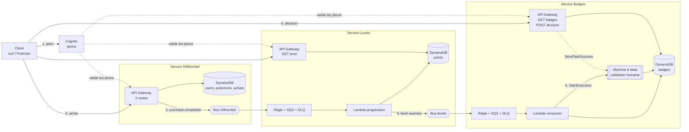

# 02 — Vue d'ensemble

## Ce que tu vas comprendre

- Ce que fait l'application, vue de l'extérieur.
- Les quatre services, et ce que chacun a le droit de savoir.
- **Le chemin complet d'un achat jusqu'à un badge, saut par saut.**
- Pourquoi les services se parlent par événements et pas par appels directs.
- Pourquoi la règle et la file appartiennent au service qui *consomme*.

## Les prérequis

[01 — Les bases d'AWS](01-les-bases-aws.md).

---

## Ce que fait l'application

Un Pokédex. Une application cliente peut :

1. Récupérer un jeton d'accès.
2. Consulter la liste des utilisateurs et le catalogue de Pokémon.
3. Enregistrer un achat : tel utilisateur acquiert tel Pokémon.
4. Consulter la progression de cet utilisateur : ses points, son niveau.
5. Consulter ses badges, et **décider** — accorder ou refuser — les badges en
   attente.

Les points 4 et 5 ne sont pas déclenchés par le client. Ils arrivent tout seuls,
en conséquence de l'achat. C'est ça, l'événementiel.

## Les quatre services

| Service | Rôle | Stack | Ce qu'il contient |
| --- | --- | --- | --- |
| **Authentification** | Délivrer les jetons | `pokedex-auth-dev` | Cognito seul : ni API, ni Lambda, ni base |
| **Référentiel** | Utilisateurs, catalogue, achats | `pokedex-app-dev` | API Gateway, 3 Lambda, DynamoDB, un bus EventBridge |
| **Levels** | Points et niveaux | `pokedex-levels-dev` | Règle + SQS + DLQ, 1 Lambda, DynamoDB, API, un bus EventBridge |
| **Badges** | Badges, avec validation humaine | `pokedex-badges-dev` | Règle + SQS + DLQ, **machine à états**, 4 Lambda, DynamoDB, API |

Il y a un cinquième stack, `pokedex-shared-dev`, qui ne contient pas un service
mais du **code partagé** : le layer Lambda avec les helpers. Voir le fichier 05.



## Le chemin complet, saut par saut

C'est la section à savoir dérouler. Chaque flèche est une frontière, et à chaque
frontière quelque chose peut échouer sans casser le reste.

**Saut 1 — Le client s'authentifie.**
`POST {domaine Cognito}/oauth2/token` avec un couple client id / secret. Cognito
renvoie un JWT valable une heure. Aucun utilisateur humain n'est impliqué : c'est
une application qui s'authentifie. → fichier 03.

**Saut 2 — Le client enregistre un achat.**
`POST /users/{userId}/purchases` sur l'API du référentiel. L'authorizer Cognito
vérifie le jeton et le scope `pokedex/write` **avant** que la Lambda soit
appelée. La Lambda `purchase.ts` vérifie que l'utilisateur et le Pokémon
existent, que le solde suffit, puis écrit dans DynamoDB en une transaction :
débit du solde et création de l'achat, tout ou rien. → fichier 04.

**Saut 3 — Le référentiel publie un fait.**
L'achat est committé, alors et seulement alors le référentiel publie sur **son**
bus EventBridge :

```
source:      fr.pokemon.referential
detail-type: purchase.completed
detail:      { eventVersion, purchaseId, userId, pokemonId, occurredAt }
```

Le référentiel ne sait pas qui écoute. Si personne n'écoute, l'événement part
dans le vide et l'achat reste valide. Si la publication échoue, l'erreur est
**avalée** : l'achat est déjà committé et le sujet exige qu'un achat reste
possible même si Levels est mort. → fichier 06.

**Saut 4 — Levels reçoit l'événement.**
Une **règle** EventBridge, qui appartient au template de Levels, filtre sur
`source` et `detail-type` et dépose le message dans une **file SQS** de Levels.
La file amortit : si la Lambda est indisponible, les messages attendent.

**Saut 5 — Levels compte les points.**
La Lambda `progression.ts` écrit un marqueur `PURCHASE#<purchaseId>` et ajoute 50
points, dans une seule transaction. Le marqueur est ce qui fait qu'un message
livré deux fois ne compte pas deux fois. → fichier 06.

**Saut 6 — Levels publie à son tour.**
Un niveau vaut 100 points, donc un achat sur deux fait franchir un palier. La
Lambda relit le total, calcule le niveau, et publie sur **son** bus :

```
source:      fr.pokemon.levels
detail-type: level.reached
detail:      { eventVersion, userId, level, points, reachedAt }
```

C'est un **fait**, pas un ordre : « cet utilisateur est au niveau 2 ». Jamais
« donne-lui le badge Collector ».

**Saut 7 — Badges reçoit l'événement.**
Même mécanique qu'au saut 4 : une règle et une file, qui appartiennent cette fois
au template de Badges.

**Saut 8 — Badges crée le badge et démarre le workflow.**
La Lambda `badge.ts` regarde son propre catalogue. Si ce niveau vaut un badge,
elle crée l'item en `PENDING`, puis démarre une **exécution de machine à états**
avec un nom déterministe. → fichier 07.

**Saut 9 — Le workflow s'arrête.**
La machine à états appelle une Lambda en lui passant un **task token**, et se met
en pause. La Lambda écrit le jeton sur le badge et ne retourne rien. L'exécution
peut rester là des jours, sans rien consommer.

**Saut 10 — Une personne décide.**
`POST /users/{userId}/badges/{badgeId}/decision` avec `{"decision": "GRANTED"}`.
La Lambda retrouve le jeton et appelle `SendTaskSuccess`. L'API répond **202** :
la décision est acceptée, mais rien n'est encore écrit.

**Saut 11 — Le workflow reprend et conclut.**
L'exécution repart exactement là où elle s'était arrêtée. Un état `Choice`
aiguille vers `GrantBadge` ou `RefuseBadge`, qui écrit le nouveau statut
directement dans DynamoDB — **sans Lambda**. Si personne n'avait décidé avant le
délai, un `Catch` sur `States.Timeout` aurait mené à `ExpireBadge`.

**Saut 12 — Le client constate.**
`GET /users/{userId}/badges` renvoie le badge en `GRANTED`, `REFUSED` ou
`EXPIRED`.

## Pourquoi des événements et pas des appels directs

Le référentiel pourrait appeler Levels en HTTP après chaque achat. Ça marcherait.
Voilà ce qu'on perdrait.

**On perdrait la disponibilité.** Un appel direct fait de Levels une dépendance
de l'achat. Levels tombe, ou ralentit, et l'achat tombe ou ralentit avec lui. Le
sujet demande explicitement le contraire, et c'est vérifiable en une commande :

```bash
make clean-levels    # on supprime tout le service Levels
# puis on refait un achat : il renvoie toujours 201
```

Ça fonctionne parce que le bus appartient au référentiel et n'a aucun besoin de
ses consommateurs pour exister.

**On perdrait l'extensibilité.** Le lot 4 ajoute un service Badges derrière
Levels. Avec des appels directs, il aurait fallu modifier Levels pour qu'il
appelle Badges. Avec un bus, on ajoute une règle dans le template de Badges et
Levels n'apprend jamais son existence. Le meilleur indicateur que la frontière
tient, c'est que **le référentiel n'a pas changé d'une seule ligne au lot 4** :

```bash
git diff HEAD~1 -- template-pokedex.yaml functions/users functions/catalog functions/purchase
# vide
```

**On perdrait l'amortissement.** Une file SQS absorbe une rafale et la restitue
au rythme que la Lambda peut suivre. Un appel direct la subit.

Ce qu'on paie en échange, et qu'il faut assumer, ce sont trois choses :

1. **De la latence.** Le badge n'apparaît pas dans la milliseconde. C'est de
   l'*eventual consistency*, et c'est pour ça que la collection Postman fait du
   polling au lieu de vérifier immédiatement.
2. **Des doublons.** EventBridge et SQS garantissent « au moins une fois », pas
   « exactement une fois ». Chaque consommateur doit être idempotent. C'est le
   sujet central du fichier 06.
3. **Un contrat à figer.** L'événement *est* l'interface entre deux services. Le
   changer casse l'autre côté silencieusement — d'où le champ `eventVersion` dans
   chaque `detail`.

## Qui possède la règle et la file

C'est le point de conception le plus important de tout le projet, et le plus
contre-intuitif.

> La règle EventBridge et la file SQS appartiennent au template du service qui
> **consomme**, jamais à celui qui publie.

Donc `template-badges.yaml` contient la règle qui écoute le bus de Levels :

```yaml
  LevelReachedRule:
    Type: AWS::Events::Rule
    Properties:
      EventBusName: !Sub '{{resolve:ssm:/pokedex/${Env}/levels/event-bus-name}}'
      EventPattern:
        source:
          - fr.pokemon.levels
        detail-type:
          - level.reached
```

Pourquoi c'est le bon découpage : un abonnement est une décision du consommateur.
C'est lui qui sait ce qui l'intéresse, à quel rythme il peut l'absorber, et où
partent ses échecs. Si le publieur déclarait les abonnements, ajouter un
consommateur voudrait dire modifier et redéployer le publieur — et on aurait
réintroduit exactement le couplage que le bus était censé supprimer.

Le publieur ne possède que **le bus**, et un contrat d'événement.

## Les pièges

**« J'ai fait un achat, le niveau ne bouge pas. »**
Normal pendant une seconde ou deux. Au-delà, c'est un vrai problème : voir le
fichier 08 pour la remonter (règle → file → DLQ → logs).

**« Mon badge reste en PENDING. »**
C'est le comportement attendu ! Un badge en attente attend une personne. Ce n'est
un problème que si `awaitingDecision` reste `false` : là, le workflow n'a pas
enregistré son jeton.

**« Je veux ajouter un service, je modifie le publieur. »**
Non. Tu ajoutes une règle et une file dans **ton** template. Si tu te retrouves à
modifier un service en amont pour brancher un service en aval, quelque chose est
à l'envers.

## Pour aller plus loin

- [La structure d'un événement EventBridge](https://docs.aws.amazon.com/eventbridge/latest/userguide/eb-events.html)
  — l'enveloppe (`source`, `detail-type`) et le contenu (`detail`), qui sont bien
  deux choses distinctes.
- [Modélisation d'un profil de joueur en DynamoDB](https://docs.aws.amazon.com/amazondynamodb/latest/developerguide/data-modeling-schema-gaming-profile.html)
  — un cas très proche du nôtre : un joueur et sa collection.

---

Précédent : [01 — Les bases d'AWS](01-les-bases-aws.md) ·
Suivant : [03 — Authentification](03-authentification-cognito.md)
