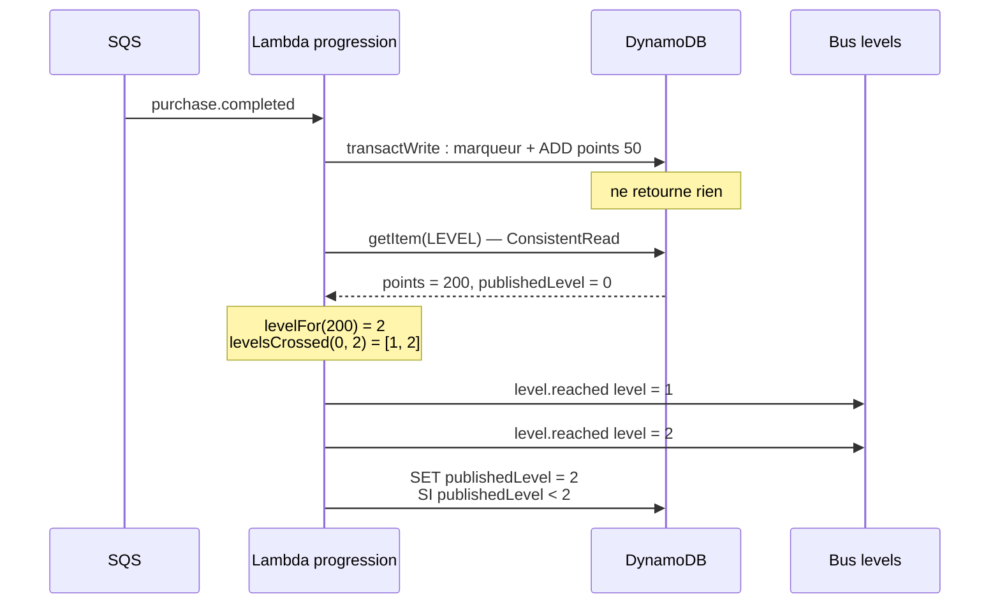

# 06 — L'événementiel : EventBridge, SQS, et l'idempotence

## Ce que tu vas comprendre

- La différence entre couplage fort et couplage faible, concrètement.
- EventBridge : bus, règle, et la séparation enveloppe / contenu.
- SQS : ce qu'une file achète, et ce qu'est une DLQ.
- Pourquoi « au moins une fois » oblige à écrire du code **idempotent**.
- Comment distinguer un échec à réessayer d'un échec définitif.
- **Le watermark `publishedLevel`** : comment Levels sait qu'un niveau a changé,
  alors qu'une transaction DynamoDB ne retourne rien.

## Les prérequis

[05 — Infrastructure as Code](05-iac-sam-et-build.md).

---

## Le problème : le couplage

Après un achat, il faut faire progresser l'utilisateur. La solution évidente :

```
purchase.ts  ──HTTP──>  levels-api  ──>  DynamoDB
```

Ce qu'on y perd a été résumé au fichier 02 ; voici la version détaillée, parce que
c'est la justification de tout ce qui suit.

**La disponibilité.** Levels devient une dépendance de l'achat. Levels tombe,
l'achat tombe. Levels met 3 secondes, l'achat met 3 secondes de plus.

**L'extensibilité.** Le lot 4 ajoute Badges derrière Levels. En appel direct, il
faudrait modifier Levels pour qu'il appelle Badges. Puis modifier Badges quand un
sixième service arrivera. Chaque ajout en aval devient une modification en amont.

**La résistance aux rafales.** Dix achats en une seconde, c'est dix écritures
simultanées sur Levels. Sans tampon, il les subit.

Le **couplage faible** inverse la relation : le référentiel annonce ce qui s'est
passé chez lui, et n'apprend jamais qui écoute.

```
purchase.ts ──publie──> bus ──> [règle → file → Lambda] Levels
                            └──> (un autre consommateur, un jour)
```

## EventBridge : le bus

Un **bus d'événements** reçoit des messages et les distribue aux **règles** qui y
sont abonnées. Si aucune règle ne correspond, le message est simplement jeté — et
ce n'est pas une erreur. C'est ce qui rend le publieur indépendant.

Chaque service qui publie a **son** bus. Deux dans le projet :

```yaml
# template-pokedex.yaml
  PurchaseEventBus:
    Type: AWS::Events::EventBus
    Properties:
      Name: !Sub '${AWS::StackName}-events'

# template-levels.yaml   (ajouté au lot 4)
  LevelsEventBus:
    Type: AWS::Events::EventBus
    Properties:
      Name: !Sub '${AWS::StackName}-events'
```

Badges n'a pas de bus : il est le dernier de la chaîne et ne publie rien.

### Enveloppe et contenu

EventBridge sépare deux choses, et la distinction est structurante :

| Champ | Rôle | Exemple |
| --- | --- | --- |
| `source` | Qui a publié | `fr.pokemon.referential` |
| `detail-type` | De quoi il s'agit | `purchase.completed` |
| `detail` | Le contenu utile | `{ purchaseId, userId, ... }` |

**Les règles filtrent sur l'enveloppe, jamais sur le contenu.** C'est pour ça que
`source` et `detail-type` doivent être stables et lisibles : ils constituent
l'index de routage.

```yaml
      EventPattern:
        source:
          - fr.pokemon.levels
        detail-type:
          - level.reached
```

### Les deux contrats du projet

Un événement **est** l'interface entre deux services. Il se fige avant d'écrire le
code des deux côtés.

```text
source:      fr.pokemon.referential
detail-type: purchase.completed
detail:      { "eventVersion": "1.0",
               "purchaseId":   "9f1c3e2a-...",
               "userId":       "3eacd9de-...",
               "pokemonId":    "pikachu",
               "occurredAt":   "2026-08-20T09:14:22.000Z" }
```

```text
source:      fr.pokemon.levels
detail-type: level.reached
detail:      { "eventVersion": "1.0",
               "userId":       "3eacd9de-...",
               "level":        2,
               "points":       100,
               "reachedAt":    "2026-08-20T09:14:25.000Z" }
```

`eventVersion` est ce qui permettra un jour de faire évoluer le format sans casser
les consommateurs : ils peuvent refuser une version qu'ils ne connaissent pas —
ce que fait le projet.

### Un fait, pas un ordre

C'est le point de conception le plus important de l'événement `level.reached`, et
le sujet y insiste.

L'événement dit **« cet utilisateur est au niveau 2 »**. Il ne dit **pas**
« attribue-lui le badge Collector ».

Si Levels nommait le badge, Levels déciderait de la politique des badges. Le
catalogue serait à deux endroits, et changer « le niveau 2 vaut désormais un
badge Champion » demanderait de modifier Levels — un service qui n'a rien à voir
avec les badges.

> Un service publie ce qui s'est passé **chez lui**. Il ne donne pas d'instruction
> à ses voisins.

C'est pour ça que le catalogue vit dans `layers/pokedex-utils/badges.ts` et n'est
lu que par le service Badges.

### Publier, et le cas où ça échoue

```ts
try {
  await publishEvent(EVENT_BUS_NAME, 'fr.pokemon.referential', 'purchase.completed', {
    eventVersion: '1.0', purchaseId, userId, pokemonId, occurredAt: createdAt,
  });
} catch (eventError) {
  // Deliberately swallowed: the purchase is already committed and the
  // brief requires it to succeed even when the Levels service is gone.
  log.error('The purchase was saved but its event could not be published.', {
    purchaseId, ...serializeError(eventError),
  });
}
```

L'erreur est **avalée**, volontairement : l'achat est déjà committé, et le renvoyer
en échec mentirait au client. On log, et on rend 201.

Un détail qui va plus loin qu'il n'y paraît : `EVENT_BUS_NAME` est lu par
`requireEnv` **au chargement du module**, pas dans le `try`. Sinon un bus mal
configuré serait avalé par ce même `catch`, et les achats réussiraient sans qu'un
seul événement soit jamais publié. Un déploiement cassé n'est pas une panne : il
doit échouer bruyamment, et tout de suite.

On verra au fichier 07 que Levels fait exactement **l'inverse** — et que c'est
aussi le bon choix, pour une raison qui s'inverse elle aussi.

## SQS : la file entre le bus et la fonction

La règle pourrait appeler la Lambda directement. On met une file entre les deux
parce qu'elle achète quatre choses :

1. **Un tampon.** Une rafale s'accumule dans la file et se consomme au rythme
   possible.
2. **Une reprise.** Lambda indisponible, les messages attendent (4 jours ici).
3. **Des réessais comptés.** Un message qui échoue revient, et au bout d'un
   nombre fixé il part ailleurs.
4. **Un endroit où regarder.** Un message coincé est visible et récupérable.

```yaml
  BadgesQueue:
    Type: AWS::SQS::Queue
    Properties:
      VisibilityTimeout: 60
      MessageRetentionPeriod: 345600     # 4 jours
      RedrivePolicy:
        deadLetterTargetArn: !GetAtt BadgesDeadLetterQueue.Arn
        maxReceiveCount: 3
```

**`VisibilityTimeout`** est le mécanisme central de SQS : quand un consommateur
reçoit un message, il devient invisible pendant ce délai. S'il est traité, il est
supprimé ; sinon il redevient visible et un autre consommateur le reprend. Ce
délai doit être **supérieur au timeout de la Lambda** (10 s ici), sinon le message
redevient visible alors que la fonction travaille encore — et il est traité deux
fois.

**`maxReceiveCount: 3`** : après trois réceptions infructueuses, SQS déplace le
message dans la **dead-letter queue**.

### La DLQ n'est pas optionnelle

Le sujet le dit, et il faut comprendre pourquoi. Sans DLQ, un message qui échoue
en boucle est réessayé jusqu'à l'expiration de sa rétention, **puis disparaît sans
laisser de trace**. Tu ne sauras jamais qu'un achat n'a pas été compté.

Avec une DLQ, le message atterrit dans une file où il attend 14 jours. Tu peux le
lire, comprendre, corriger, et le rejouer. → fichier 08.

Le projet en a même **deux niveaux**, et c'est délibéré :

```yaml
      Targets:
        - Id: BadgesQueue
          Arn: !GetAtt BadgesQueue.Arn
          DeadLetterConfig:
            Arn: !GetAtt BadgesDeadLetterQueue.Arn
          RetryPolicy:
            MaximumEventAgeInSeconds: 3600
            MaximumRetryAttempts: 10
```

Ce `DeadLetterConfig`-là couvre le saut **bus → file**, distinct du `RedrivePolicy`
qui couvre le saut **file → fonction**. Les deux sauts peuvent perdre un message,
pour des raisons différentes.

### La politique de file

```yaml
  BadgesQueuePolicy:
    Type: AWS::SQS::QueuePolicy
    Properties:
      PolicyDocument:
        Statement:
          - Effect: Allow
            Principal:
              Service: events.amazonaws.com
            Action: sqs:SendMessage
            Condition:
              ArnEquals:
                aws:SourceArn: !GetAtt LevelReachedRule.Arn
```

Une file a une *resource policy* : elle dit qui peut y écrire. La `Condition` est
la partie qui compte — sans elle, **n'importe quelle** règle EventBridge du compte
pourrait injecter des messages dans cette file. Là, une seule règle nommément
désignée y a droit.

## « Au moins une fois », donc l'idempotence

Voici le fait à accepter : **EventBridge et SQS garantissent la livraison au moins
une fois, pas exactement une fois.** Un même message peut arriver deux fois. Ce
n'est pas un bug qu'on peut corriger : c'est la propriété du système.

Sans protection, un achat livré deux fois compterait 100 points au lieu de 50.

Le sujet propose deux réponses ; le projet prend la première.

### La solution retenue : un marqueur de traitement

```ts
await transactWrite(TABLE_NAME, [
  {
    Put: {
      Item: {
        PK: userKey,
        SK: `PURCHASE#${purchaseId}`,
        entity: 'PROCESSED_PURCHASE',
        // ...
      },
      // A Put supplies the whole primary key, so PK alone already means
      // "no marker at this exact PK and SK".
      ConditionExpression: 'attribute_not_exists(PK)',
    },
  },
  {
    Update: {
      Key: { PK: userKey, SK: 'LEVEL' },
      UpdateExpression: 'SET ... ADD points :points',
      // ...
    },
  },
]);
```

Les deux opérations sont dans **une seule transaction**, donc indissociables. La
seconde livraison du même `purchaseId` fait échouer la condition, ce qui annule la
transaction entière — les points ne sont pas ajoutés.

Ce que la transaction achète et qu'une séquence de deux écritures n'achèterait
pas : il n'existe **aucun** instant où le marqueur existe sans les points, ou
l'inverse. Une panne entre les deux est impossible par construction.

Puis on distingue « déjà traité » d'une vraie panne :

```ts
} catch (error) {
  if (!isErrorNamed(error, 'TransactionCanceledException')) {
    throw error;
  }

  const processedPurchase = await getItem(TABLE_NAME, userKey, `PURCHASE#${purchaseId}`);

  if (!processedPurchase) {
    throw error;
  }

  log.info('Purchase was already counted.', { purchaseId });
}
```

Une transaction annulée peut l'être pour plusieurs raisons — dont un conflit
d'écriture concurrent, qui *mérite* un réessai. On relit donc le marqueur : s'il
est là, c'est un doublon, on log en `info` et on continue. S'il n'est pas là,
l'erreur remonte.

### L'alternative : une file FIFO

Une file FIFO garantit l'ordre et déduplique sur une fenêtre de 5 minutes. C'est
plus simple à écrire, mais :

- La déduplication ne dure que 5 minutes. Un message redélivré après ce délai
  passe.
- Le débit est plus limité.
- **La déduplication protège la file, pas la base.** Si la Lambda plante après
  avoir écrit, un réessai réécrit. Il faudrait de toute façon rendre l'écriture
  idempotente.

Le marqueur est donc à la fois plus robuste et plus général. Il ne dépend d'aucune
fenêtre de temps.

### Les échecs partiels de lot

Lambda lit jusqu'à 10 messages à la fois. Par défaut, si l'invocation échoue, **les
dix** sont redélivrés — donc un message malformé bloque neuf messages sains.

```yaml
            BatchSize: 10
            FunctionResponseTypes:
              - ReportBatchItemFailures
```

Cette option permet à la fonction de dire précisément lesquels ont échoué :

```ts
const batchItemFailures: SQSBatchItemFailure[] = [];

for (const record of event.Records || []) {
  try {
    // ...
  } catch (error) {
    recordLog.error('Could not process level event.', serializeError(error));
    batchItemFailures.push({ itemIdentifier: record.messageId });
  }
}

return { batchItemFailures };
```

La forme du retour est vérifiée par le type `SQSHandler` : mal orthographier
`itemIdentifier` ferait cesser silencieusement le report des échecs, et
maintenant ça casse le build.

## Réessayable ou définitif

Le sujet demande de distinguer les deux, et c'est le bon réflexe : réessayer trois
fois un message qui échouera à l'identique gaspille du temps et brouille les logs.

| Nature | Exemples | Ce qu'on fait |
| --- | --- | --- |
| **Définitif** | JSON invalide, `source` inattendue, `eventVersion` inconnue, champ obligatoire absent | On lance tout de suite. Trois réessais donneront le même résultat. |
| **Réessayable** | Conflit d'écriture DynamoDB, throttling, service momentanément indisponible | On laisse remonter : SQS redélivrera et ça passera. |
| **Ni l'un ni l'autre** | Un niveau qui ne vaut aucun badge | On **acquitte** et on ne crée rien. Ce n'est pas un échec. |

La validation de l'enveloppe est faite en premier, avant tout accès à la base :

```ts
function levelReached(record: SQSRecord): LevelReached {
  const event = JSON.parse(record.body);
  const detail = event.detail;

  if (event.source !== 'fr.pokemon.levels'
    || event['detail-type'] !== 'level.reached'
    || detail?.eventVersion !== '1.0') {
    throw new Error('Unsupported level event.');
  }
  // ...
}
```

Et le troisième cas — celui qu'on oublie — est explicite dans le consumer de
Badges :

```ts
if (!badge) {
  recordLog.info('No badge is defined for this level.', { level: reached.level });
  continue;
}
```

`continue`, pas `throw`. Le message est acquitté. Lancer ici enverrait un
événement parfaitement valide en DLQ trois tentatives plus tard.

## Le watermark : comment Levels sait qu'un niveau a changé

C'est la question que le sujet pose explicitement, et c'est le cœur de la
modification du lot 4.

### Le problème

`TransactWriteItems` **ne retourne aucune valeur.** Contrairement à un
`UpdateItem` seul, qui peut renvoyer ce qu'il vient d'écrire via `ReturnValues`,
une transaction ne renvoie rien du tout. Donc après avoir ajouté 50 points, la
Lambda ne sait pas combien l'utilisateur en a.

### Le modèle

Avant le lot 4, le code faisait `ADD points 100, level 1` : un achat valait
exactement un niveau. La question « le niveau a-t-il changé ? » ne se posait donc
jamais — la réponse était toujours oui, et l'énoncé était esquivé.

Le lot 4 sépare les deux :

```ts
export const POINTS_PER_PURCHASE = 50;
export const POINTS_PER_LEVEL = 100;

export function levelFor(points: unknown): number {
  if (typeof points !== 'number' || !Number.isFinite(points) || points <= 0) {
    return 0;
  }
  return Math.floor(points / POINTS_PER_LEVEL);
}
```

Un palier tous les **deux** achats, donc un achat sur deux ne change rien.

Le niveau n'est plus stocké : il est **dérivé** de `points`. Une seule source de
vérité. Stocker les deux créerait deux valeurs pour un même fait, et la seule
question intéressante à propos de deux sources de vérité est le jour où elles
divergeront.

L'item devient :

```
PK = USER#<userId>   SK = LEVEL
{ userId, points, publishedLevel, updatedAt }
```

`publishedLevel` est le **watermark** : le niveau le plus élevé déjà annoncé sur
le bus.

### La séquence



Étape par étape, dans `functions/levels-consumer/progression.ts` :

```ts
async function publishReachedLevels(userId: string, log: Logger): Promise<void> {
  const userKey = `USER#${userId}`;
  const item = await getItem<LevelItem>(TABLE_NAME, userKey, 'LEVEL');
  const points = item?.points ?? 0;
  const reached = levelFor(points);
  const levels = levelsCrossed(item?.publishedLevel, reached);

  if (levels.length === 0) {
    return;
  }

  for (const level of levels) {
    await publishEvent(EVENT_BUS_NAME, 'fr.pokemon.levels', 'level.reached', {
      eventVersion: '1.0', userId, level, points,
      reachedAt: new Date().toISOString(),
    });
  }

  // Only after the events are out.
  await updateItem(TABLE_NAME, userKey, 'LEVEL', {
    UpdateExpression: 'SET publishedLevel = :reached',
    ConditionExpression:
      'attribute_not_exists(publishedLevel) OR publishedLevel < :reached',
    ExpressionAttributeValues: { ':reached': reached },
  });
}
```

**`ConsistentRead`** répond à la question du sujet. `getItem` du layer le demande
toujours :

```ts
const result = await documentClient.send(new GetCommand({
  TableName: tableName,
  Key: { PK, SK },
  ConsistentRead: true,
}));
```

DynamoDB réplique sur plusieurs copies, et une lecture par défaut peut tomber sur
une copie qui n'a pas encore l'écriture. Une lecture **fortement cohérente** voit
forcément l'écriture qui vient d'être committée. Elle coûte deux fois plus cher en
unités de lecture, et c'est un prix qu'on accepte ici : lire une valeur périmée
publierait le mauvais niveau.

### L'ordre publier-puis-avancer

C'est **le** point de conception. Les événements partent d'abord, le watermark
avance ensuite.

Si on inversait, une panne réseau sur `PutEvents` après avoir avancé le watermark
perdrait le niveau **définitivement** : plus rien ne le republierait jamais. Ce
serait de l'*at-most-once*.

Dans cet ordre, une panne entre les deux fait qu'au prochain achat, `publishedLevel`
est toujours en retard, et le niveau manquant est republié. C'est de
l'*at-least-once* : au pire un doublon, jamais une perte.

> **En événementiel, on choisit toujours le doublon plutôt que la perte.** Un
> doublon, on sait le rattraper en aval — c'est tout le sujet de la section
> précédente. Une perte, non.

### Ce que ça répond, cas par cas

**Un événement est perdu.** `publishedLevel` n'a pas avancé. Le prochain achat
appelle `levelsCrossed(1, 2)` → `[2]` et republie. **Auto-réparation.**

**Deux achats franchissent deux paliers d'un coup.** `levelsCrossed(0, 2)` →
`[1, 2]`. Deux événements, deux badges. Aucun palier sauté :

```ts
export function levelsCrossed(published: unknown, reached: number): number[] {
  const watermark = typeof published === 'number' && Number.isFinite(published)
    ? Math.max(Math.floor(published), 0)
    : 0;
  const levels: number[] = [];

  for (let level = watermark + 1; level <= reached; level += 1) {
    levels.push(level);
  }

  return levels;
}
```

**Deux invocations en concurrence.** Les deux peuvent lire le même watermark et
publier le même niveau. Le doublon est absorbé par Badges (clé de badge + nom
d'exécution, → fichier 07). Et l'écriture du watermark est conditionnelle, donc
celle qui arrive avec une valeur plus basse échoue — ce qui est le bon résultat, et
n'est pas traité comme une panne :

```ts
} catch (error) {
  if (!isErrorNamed(error, 'ConditionalCheckFailedException')) {
    throw error;
  }
  log.info('The watermark had already moved past this level.', { reached });
}
```

**Un message redélivré.** Les points sont déjà comptés, donc `publishedLevel`
égale déjà le niveau atteint, donc `levelsCrossed` renvoie `[]`. Rien n'est
republié.

### L'inversion du traitement d'erreur

`publishReachedLevels` est appelé **même quand l'achat était déjà compté** :

```ts
const detail = purchaseDetail(record);

await countPurchase(detail, recordLog);
// Deliberately outside countPurchase, and reached even when the purchase
// was already counted. That is what repairs a level whose event failed to
// publish on an earlier delivery.
await publishReachedLevels(detail.userId, recordLog);
```

Et ses erreurs **remontent**, alors que `purchase.ts` avale les siennes. Les deux
choix sont corrects, et c'est l'inversion qu'il faut comprendre :

| | `purchase.ts` | `progression.ts` |
| --- | --- | --- |
| Contexte | Une requête HTTP synchrone | Un message SQS |
| L'écriture est faite | Oui, committée | Oui, committée |
| Un réessai est-il possible ? | **Non** — le client est parti | **Oui** — SQS redélivre |
| Donc | On avale, on log, on rend 201 | On laisse remonter |

Dans le second cas, remonter n'est pas un aveu d'échec : c'est ce qui **répare**.
SQS redélivre, `countPurchase` voit son marqueur et n'ajoute rien, et
`publishReachedLevels` émet l'événement qui manquait.

## Les pièges

**Le même message est traité deux fois même sans redélivrance visible**
`VisibilityTimeout` inférieur au timeout de la Lambda. Le message redevient
visible pendant que la fonction travaille encore.

**Un message part en DLQ sans qu'aucune erreur n'apparaisse dans les logs**
Souvent la Lambda dépasse son timeout : elle est tuée avant d'écrire son log
d'erreur. Regarde la durée dans le rapport `REPORT` de CloudWatch.

**La règle ne déclenche rien**
Trois causes, dans cet ordre de fréquence : le mauvais bus (les règles sur le bus
`default` sont un classique — il faut `EventBusName`), un `source` ou
`detail-type` qui ne correspond pas exactement, ou la `QueuePolicy` qui manque —
dans ce dernier cas EventBridge n'a pas le droit d'écrire et l'échec est
silencieux du point de vue de la règle.

**`PutEvents` renvoie 200 mais l'événement n'arrive pas**
`PutEvents` réussit **par entrée**. Il faut regarder `FailedEntryCount` dans la
réponse, ce que le helper fait :

```ts
if (result.FailedEntryCount) {
  const failure = result.Entries?.[0];
  throw new Error(`EventBridge rejected the event: ${errorCode}${errorMessage}`);
}
```

**Un achat n'est jamais compté, et rien nulle part**
Vérifie que le publieur a bien `events:PutEvents` sur le bus. Sans le droit,
`purchase.ts` avale l'erreur — par conception — et seul le log la mentionne.

## Pour aller plus loin

- [La structure d'un événement EventBridge](https://docs.aws.amazon.com/eventbridge/latest/userguide/eb-events.html)
  — l'enveloppe et le contenu.
- [Les patterns d'événements](https://docs.aws.amazon.com/eventbridge/latest/userguide/eb-event-patterns.html)
  — la syntaxe de filtrage, bien plus riche que ce qu'on utilise ici.
- [Les dead-letter queues SQS](https://docs.aws.amazon.com/AWSSimpleQueueService/latest/SQSDeveloperGuide/sqs-dead-letter-queues.html)
  — à quoi elles servent et comment les dimensionner.
- [Gestion des erreurs avec SQS et Lambda](https://docs.aws.amazon.com/lambda/latest/dg/services-sqs-errorhandling.html)
  — ce qui se passe exactement quand le traitement échoue, et
  `ReportBatchItemFailures`. **La page la plus utile de cette liste.**
- [Cohérence des lectures DynamoDB](https://docs.aws.amazon.com/amazondynamodb/latest/developerguide/HowItWorks.ReadConsistency.html)
  — pourquoi `ConsistentRead` existe et ce qu'il coûte.
- [Les transactions DynamoDB](https://docs.aws.amazon.com/amazondynamodb/latest/developerguide/transaction-apis.html)
  — et la confirmation que `TransactWriteItems` ne retourne pas de valeurs.

---

Précédent : [05 — Infrastructure as Code](05-iac-sam-et-build.md) ·
Suivant : [07 — Step Functions et les badges](07-step-functions-badges.md)
