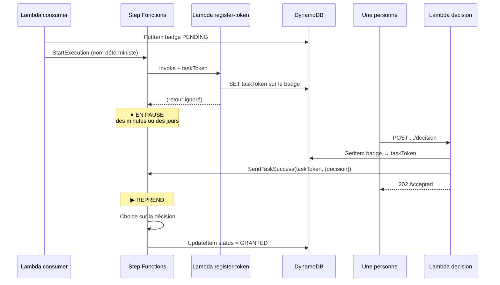

# 07 — Step Functions et le service Badges

## Ce que tu vas comprendre

- Ce qu'est une machine à états, et pourquoi on n'écrit pas ça dans une Lambda.
- ASL, le langage de définition, et JSONata pour manipuler les données.
- Standard ou Express, et pourquoi le choix est **imposé** ici.
- **Le task token** : la chronologie complète d'une attente de décision humaine.
- Pourquoi un refus passe par `SendTaskSuccess` et pas `SendTaskFailure`.
- Les intégrations de service natives : trois écritures, zéro Lambda.
- Les trois idempotences du service, et la course décision / expiration.

## Les prérequis

[06 — L'événementiel](06-evenementiel-eventbridge-sqs.md). Surtout la partie sur
le contrat `level.reached`.

---

## Le problème : attendre une personne

Chaque niveau atteint ouvre droit à un badge, mais le badge n'est attribué
qu'après validation par un humain. Cette attente peut durer **une minute ou trois
jours**.

Regardons pourquoi les solutions évidentes ne marchent pas.

**Une Lambda qui attend.** Une Lambda a un timeout maximum de 15 minutes, et on
paie sa durée d'exécution. Une Lambda qui dort trois jours n'existe pas, et si
elle existait, on paierait trois jours de calcul pour ne rien faire.

**Un statut en base et un cron qui vérifie.** Ça marche, et c'est ce qu'on fait
sans Step Functions. Mais il faut alors écrire soi-même : la reprise là où on
s'était arrêté, la détection de l'expiration, la gestion des réessais, la trace de
ce qui s'est passé. Toute cette plomberie devient du code à maintenir et à tester.

**Ce que Step Functions apporte** : un état de workflow **persistant et géré**. On
peut mettre une exécution en pause pour un an, sans payer de temps d'attente — on
paie les transitions d'état, et une attente n'en est pas une. Et le graphe est
visible dans la console : on voit où en est chaque badge.

## Ce qu'est une machine à états

Un **workflow** défini comme une liste d'**états**, chacun disant ce qu'il fait et
où aller ensuite. Step Functions exécute ce graphe, une **exécution** à la fois,
en gardant l'état courant et les données.

Les types d'état qui nous servent (il en existe huit) :

| Type | Rôle |
| --- | --- |
| `Task` | Fait quelque chose : appeler une Lambda, écrire dans DynamoDB… |
| `Choice` | Aiguille selon une condition |
| `Pass` | Ne fait rien, sert à transformer ou à stocker des données |
| `Succeed` | Termine l'exécution en succès |
| `Fail` | Termine l'exécution en échec |

Les trois autres (`Wait`, `Parallel`, `Map`) ne sont pas utilisés ici.

## Standard ou Express : le choix est imposé

Step Functions propose deux types de workflow, et le sujet prévient qu'il faut le
savoir **avant** de commencer.

| | Standard | Express |
| --- | --- | --- |
| Durée max | **1 an** | 5 minutes |
| `.waitForTaskToken` | **Supporté** | **Non supporté** |
| Sémantique | Exactement une fois | Au moins une fois |
| Historique | 90 jours, interrogeable | CloudWatch Logs seulement |
| Facturation | Par transition d'état | Par exécution + durée |

Deux lignes suffisent : Express ne supporte **pas du tout** le rappel par jeton, et
plafonne à cinq minutes. Un workflow qui attend une personne ne peut donc pas être
Express.

```yaml
  BadgeValidationStateMachine:
    Type: AWS::Serverless::StateMachine
    Properties:
      Type: STANDARD
```

## ASL et JSONata

Une machine à états se décrit en **ASL** (Amazon States Language), du JSON. Le
projet la garde dans un fichier séparé, `statemachine/badge-validation.asl.json`,
plutôt qu'inline dans le template : le fichier reste du JSON valide, donc lisible,
lintable, et testable dans la console.

### JSONata plutôt que JSONPath

Historiquement, ASL manipulait les données avec **JSONPath** et cinq champs
distincts : `InputPath`, `Parameters`, `ResultSelector`, `ResultPath`,
`OutputPath`. C'est verbeux et difficile à suivre.

Depuis fin 2024, ASL supporte **JSONata**, activé une fois en tête :

```json
{
  "QueryLanguage": "JSONata",
  "StartAt": "LoadBadge",
  "States": { }
}
```

Il ne reste alors que trois champs à connaître :

- **`Arguments`** — ce qu'on passe à la tâche.
- **`Output`** — ce qu'on transmet à l'état suivant.
- **`Assign`** — des **variables** qui restent disponibles dans tous les états
  suivants.

Les expressions JSONata sont entre `` :

```json
"PK": { "S": "" }
```

`&` est la concaténation en JSONata (pas `+`). `$badge` est une variable qu'on a
assignée plus tôt. `$states.input` est l'entrée de l'état courant,
`$states.result` son résultat, et `$states.context` donne accès au contexte
d'exécution — c'est là que vit le task token.

> **Le piège à connaître** : `Assign` et `Output` sont évalués **en parallèle**.
> Une variable assignée dans un état n'est **pas** disponible dans le `Output` du
> même état. Elle ne l'est qu'à partir de l'état suivant.

## Le task token : la chronologie complète

C'est le mécanisme central du lot 4. Il faut le comprendre dans l'ordre, parce que
l'ordre est **imposé** et qu'on ne peut pas le contourner.



### Ce que le sujet appelle « l'ordre imposé »

Le jeton **n'existe pas avant que la tâche soit démarrée**. La séquence est donc,
obligatoirement :

1. L'exécution démarre.
2. La tâche est invoquée, **avec** le jeton.
3. La tâche l'enregistre.
4. L'exécution se met en pause.

On ne peut donc **pas** stocker le jeton avant de démarrer le workflow. Et comme la
décision arrivera sur une **autre** Lambda, peut-être des jours plus tard, dans un
conteneur qui n'a aucune mémoire de celui-ci (→ fichier 01), il faut le persister
quelque part. Ici : sur l'item du badge.

### L'état qui attend

```json
"RegisterDecision": {
  "Type": "Task",
  "Resource": "arn:aws:states:::lambda:invoke.waitForTaskToken",
  "Arguments": {
    "FunctionName": "${RegisterTokenFunctionArn}",
    "Payload": {
      "userId": "",
      "level": "",
      "badgeId": "",
      "taskToken": ""
    }
  },
  "TimeoutSeconds": "",
  "Assign": { "decision": "" },
  "Retry": [ ],
  "Catch": [ { "ErrorEquals": ["States.Timeout"], "Next": "ExpireBadge" } ],
  "Next": "RouteDecision"
}
```

Le suffixe **`.waitForTaskToken`** sur le `Resource` est ce qui change tout. Sans
lui, Step Functions appelle la Lambda et continue avec son retour. Avec lui, Step
Functions génère un jeton, le rend disponible via
`$states.context.Task.Token`, appelle la Lambda, puis **attend**.

`$states.result` n'est donc **pas** le retour de la Lambda : c'est ce qui sera
passé plus tard à `SendTaskSuccess`. Le retour de la Lambda est purement et
simplement ignoré.

### La Lambda qui n'a rien à retourner

C'est la fonction la plus contre-intuitive du projet
(`functions/badges-token/token.ts`) :

```ts
export const handler: Handler<RegisterTokenEvent, void> = async (event, context) => {
  const { userId, taskToken } = requireStrings(event, ['userId', 'taskToken']);
  const level = requireInteger(event.level, 'level', { min: 1 });

  await updateItem(TABLE_NAME, `USER#${userId}`, badgeSortKey(level), {
    UpdateExpression: 'SET taskToken = :taskToken, tokenRegisteredAt = :now',
    ConditionExpression: 'attribute_exists(PK) AND #status = :pending',
    ExpressionAttributeNames: { '#status': 'status' },
    ExpressionAttributeValues: {
      ':taskToken': taskToken,
      ':now': new Date().toISOString(),
      ':pending': 'PENDING',
    },
  });

  // The token itself is never logged. It is a bearer credential.
  log.info('Registered the callback token.', { userId, level, badgeId: event.badgeId });
};
```

Trois points qui méritent d'être signalés.

**Elle ne retourne rien** (`Handler<..., void>`). C'est normal : son unique travail
est de rendre le jeton retrouvable.

**Le jeton n'est jamais loggé.** C'est un *bearer credential* : quiconque le
détient peut reprendre l'exécution et décider à la place de l'humain. Un jeton dans
CloudWatch Logs est un jeton fuité. Même raison pour le réglage du template :

```yaml
      Logging:
        Level: ALL
        IncludeExecutionData: false
```

`IncludeExecutionData: false` est délibéré : les données d'exécution contiennent
l'entrée de chaque état, donc le jeton. On garde les transitions dans les logs, pas
les données.

**Un `SET` simple**, pas une écriture conditionnelle sur le jeton. Si Step
Functions réessaie cette tâche, le dernier jeton enregistré est le bon et les
précédents sont morts de toute façon. En revanche la condition
`attribute_exists(PK) AND #status = :pending` refuse d'armer un badge inexistant ou
déjà décidé — l'unicité des noms d'exécution que garantit Step Functions ne dure
que 90 jours, et sans cette condition une exécution démarrée bien après une
décision pourrait rouvrir un badge réglé.

### Reprendre l'exécution

`functions/badges-decision/decision.ts` :

```ts
const badge = await getItem<BadgeItem>(TABLE_NAME, `USER#${userId}`, badgeSortKey(level));

if (!badge) {
  throw new HttpError(404, `Badge ${badgeIdFor(level)} was not found for user ${userId}.`);
}
if (badge.status !== 'PENDING') {
  throw new HttpError(409, `Badge ${badgeIdFor(level)} was already decided.`, {
    status: badge.status,
  });
}
if (!badge.taskToken) {
  throw new HttpError(409, `Badge ${badgeIdFor(level)} is not ready for a decision yet.`);
}

await sendTaskSuccess(badge.taskToken, {
  decision,
  reason: reason ?? '',
  decidedAt: new Date().toISOString(),
});
```

Le troisième cas est une vraie fenêtre de course, pas de la paranoïa : le consumer
écrit le badge, **puis** démarre l'exécution, **puis** la tâche enregistre le
jeton. Un client qui interroge `GET /badges` très vite peut voir un badge `PENDING`
dont le jeton n'est pas encore là.

C'est pour ça que la route de lecture expose un booléen dérivé
(`functions/badges-api/badges.ts`) :

```ts
      badges: badges
        .sort((a, b) => (a.level || 0) - (b.level || 0))
        .map(({ taskToken, ...badge }) => ({
          ...badge,
          awaitingDecision: badge.status === 'PENDING' && Boolean(taskToken),
        })),
```

Le jeton est **lu** — il faut bien savoir s'il existe — mais il est déstructuré
hors de l'objet renvoyé. Le booléen sort, le jeton non. Un client sait donc
attendre que `awaitingDecision` soit vrai, ce que fait la collection Postman.

### Le 202, et pourquoi ce n'est pas un 200

```ts
return jsonResponse(202, {
  badgeId: badgeIdFor(level),
  userId, level, decision, reason,
  message: 'The decision was accepted and is being applied by the workflow.',
});
```

`SendTaskSuccess` a relancé l'exécution, mais c'est la machine à états qui écrira
le nouveau statut, un instant plus tard. Répondre 200 prétendrait que le travail
est fait. **202 Accepted** dit exactement la vérité : c'est reçu, ce n'est pas
encore appliqué.

## Un refus n'est pas une erreur technique

Le sujet insiste, et c'est l'erreur de conception la plus tentante.

Un badge refusé est un **résultat parfaitement normal**. Il voyage donc par
`SendTaskSuccess`, avec la décision dans le contenu :

```json
{ "decision": "REFUSED", "reason": "Not this time.", "decidedAt": "..." }
```

Puis un `Choice` aiguille :

```json
"RouteDecision": {
  "Type": "Choice",
  "Choices": [
    { "Condition": "", "Next": "GrantBadge" },
    { "Condition": "", "Next": "RefuseBadge" }
  ],
  "Default": "UnexpectedDecision"
}
```

**`SendTaskFailure` est réservé aux vraies pannes.** Utilisé pour un refus, il
déclencherait les `Retry` et les `Catch` de la machine — réessayer trois fois un
refus que quelqu'un a délibérément choisi n'a aucun sens, et le `Catch` sur
`States.Timeout` pourrait même marquer le badge `EXPIRED` alors qu'il vient
d'être refusé.

Le `Default` mène à un état `Fail`. C'est de la défense en profondeur : la route
de décision ne laisse passer que `GRANTED` ou `REFUSED`, donc y arriver signifie
que quelque chose a contourné l'API.

## Trois écritures, zéro Lambda

Les trois états terminaux écrivent **directement** dans DynamoDB, sans passer par
une fonction :

```json
"GrantBadge": {
  "Type": "Task",
  "Resource": "arn:aws:states:::dynamodb:updateItem",
  "Arguments": {
    "TableName": "${BadgesTableName}",
    "Key": {
      "PK": { "S": "" },
      "SK": { "S": "" }
    },
    "UpdateExpression": "SET #status = :status, decidedAt = :decidedAt, decisionReason = :reason REMOVE taskToken",
    "ConditionExpression": "#status = :pending",
    "ExpressionAttributeNames": { "#status": "status" },
    "ExpressionAttributeValues": {
      ":status":    { "S": "GRANTED" },
      ":pending":   { "S": "PENDING" },
      ":decidedAt": { "S": "" },
      ":reason":    { "S": "" }
    }
  },
  "Catch": [ { "ErrorEquals": ["DynamoDB.ConditionalCheckFailedException"], "Next": "AlreadySettled" } ],
  "End": true
}
```

Une Lambda dont tout le corps est un `UpdateItem`, c'est un cold start, un rôle
IAM et un fichier de code achetés pour rien — et surtout, ça **cache** l'écriture
dans le graphe d'exécution. En natif, la console montre l'écriture.

Quatre détails à ne pas rater :

**Le format AttributeValue brut.** L'intégration native attend `{"S": "GRANTED"}`,
pas `"GRANTED"`. Le format « document client » auquel on est habitué en Node.js
est une commodité du SDK ; l'API DynamoDB, elle, veut des types explicites. C'est
l'erreur classique.

**`#status`.** `status` est un mot réservé DynamoDB, donc jamais littéral dans une
expression (→ fichier 04).

**`REMOVE taskToken`.** Pas cosmétique : ça retire le jeton dès qu'il est consommé.
Un jeton qui traîne sur un badge décidé est un secret sans usage, donc un secret
qui ne devrait plus être là.

**`TimeoutSeconds` en expression JSONata.** Détail technique mais instructif :

```json
"TimeoutSeconds": ""
```

`DefinitionSubstitutions` (voir plus bas) injecte une **chaîne** dans le fichier.
Un `${DecisionTimeoutSeconds}` nu là où JSON attend un nombre casserait le fichier
JSON sur le disque. Comme JSONata est accepté dans ce champ, on substitue à
l'intérieur d'une expression et `$number()` reconvertit. Le fichier reste du JSON
valide, donc lintable.

## L'expiration

Sans délai, une exécution attend jusqu'à un an : le badge resterait `PENDING`
indéfiniment et l'exécution ouverte.

```json
"Catch": [ { "ErrorEquals": ["States.Timeout"], "Next": "ExpireBadge" } ]
```

`States.Timeout` est une erreur prédéfinie de Step Functions, levée quand
`TimeoutSeconds` est dépassé. On l'attrape et on marque le badge `EXPIRED`.

### Le piège que ça révèle

Un état qui échoue **n'exécute pas son `Assign`**. Donc si `$badge` était assigné
dans `RegisterDecision`, la branche `ExpireBadge` ne saurait pas quel badge
expirer. D'où le premier état de la machine, qui ne fait rien d'autre :

```json
"LoadBadge": {
  "Type": "Pass",
  "Assign": { "badge": "" },
  "Next": "RegisterDecision"
}
```

Un `Pass` qui coûte une transition d'état et achète la certitude que `$badge`
existe dans **toutes** les branches, y compris celles atteintes par erreur.

### La course décision / expiration

Que se passe-t-il si une décision arrive à l'instant exact où le délai expire ?

Les deux branches essaient d'écrire, chacune avec `ConditionExpression:
"#status = :pending"`. **Une seule gagne** ; la seconde voit sa condition échouer :

```json
"Catch": [ { "ErrorEquals": ["DynamoDB.ConditionalCheckFailedException"], "Next": "AlreadySettled" } ]
```

```json
"AlreadySettled": { "Type": "Succeed" }
```

Un `Succeed`, pas un `Fail`. Perdre cette course est le **résultat normal** : il
faut bien qu'exactement une branche gagne. Faire échouer l'exécution polluerait la
console d'échecs qui n'en sont pas.

Symétriquement, côté API, `SendTaskSuccess` sur un jeton qui n'attend plus lève
une erreur — traitée en 409 :

```ts
const SETTLED_TOKEN_ERRORS = ['TaskTimedOut', 'TaskDoesNotExist', 'InvalidToken'];

if (SETTLED_TOKEN_ERRORS.some((name) => isErrorNamed(error, name))) {
  log.warn('The callback token was no longer waiting.', { userId, level });
  throw new HttpError(409, `Badge ${badgeIdFor(level)} was already decided or has expired.`);
}
```

C'est exactement ce que le sujet demande : **deux personnes qui décident en même
temps**, la seconde reçoit « déjà décidé », pas une panne.

## Les trois idempotences

Le sujet le formule ainsi : « deux fois ne doit produire ni deux badges, ni deux
exécutions ». Il y a en fait trois protections, à trois niveaux.

### 1. Le badge : la clé suffit

```ts
await putItemConditional(TABLE_NAME, { PK: `USER#${userId}`, SK: badgeSortKey(level), /* ... */ },
  'attribute_not_exists(PK)');
```

Un badge par utilisateur et par niveau, garanti par la clé elle-même. Un événement
redélivré retombe sur la même `PK`/`SK`, la condition échoue, aucun second badge.

### 2. L'exécution : le nom déterministe

C'est l'astuce la plus élégante du lot. **Step Functions refuse de démarrer deux
exécutions du même nom.** Un nom déterministe donne donc l'idempotence
gratuitement — sans verrou, sans table de déduplication.

```ts
export function executionNameFor(userId: string, level: number): string {
  const suffix = `-lvl-${level}`;
  const name = `badge-${userId}${suffix}`;

  if (SAFE_NAME.test(userId) && name.length <= MAX_EXECUTION_NAME_LENGTH) {
    return name;
  }

  const digest = createHash('sha256').update(userId).digest('hex').slice(0, 32);

  return `badge-${digest}${suffix}`;
}
```

La branche de secours n'est pas de la coquetterie. Step Functions plafonne un nom
à 80 caractères et interdit certains caractères. La tentation serait de tronquer,
ou de remplacer les caractères interdits par des tirets — c'est déterministe, mais
**pas injectif** : deux `userId` différents pourraient produire un seul nom. Step
Functions rejetterait alors la seconde exécution comme un doublon, et **ce
badge-là resterait `PENDING` sans workflow, pour toujours.** D'où le hash : tout
ce qui n'est pas déjà court et sûr est haché, jamais mutilé.

C'est exactement ce que vérifient les tests (`tests/badges.test.js`) :

```js
test('an execution name never collapses two users onto one name', () => {
  assert.notEqual(
    executionNameFor(`${'u'.repeat(80)}a`, 1),
    executionNameFor(`${'u'.repeat(80)}b`, 1),
  );
  assert.notEqual(executionNameFor('user#1', 1), executionNameFor('user$1', 1));
});
```

### 3. Les deux tolérances sont indépendantes

Ce détail vaut le détour, parce que la version naïve introduit un bug permanent.

```ts
// The two steps are tolerated independently, and that is deliberate. If
// an existing badge made us skip the second step, a StartExecution that
// failed after the badge was written would never be retried, and the
// badge would stay PENDING with no workflow behind it forever.
await createPendingBadge(reached, badge, recordLog);
await startValidation(reached, recordLog);
```

La version tentante serait : « si le badge existe déjà, on sort ». Mais si le
`PutItem` a réussi et que le `StartExecution` a échoué juste après, la
redélivrance verrait le badge exister et sortirait — et **aucune exécution ne
serait jamais démarrée**.

En laissant les deux étapes s'exécuter à chaque livraison, chacune tolérant son
propre « déjà fait », l'état **converge** :

```ts
} catch (error) {
  if (!isErrorNamed(error, 'ConditionalCheckFailedException')) { throw error; }
  log.info('The badge already existed.', { level: event.level });
}
```

```ts
} catch (error) {
  if (!isErrorNamed(error, 'ExecutionAlreadyExists')) { throw error; }
  log.info('The workflow was already started for this badge.', { executionName: name });
}
```

> **Le principe général** : dans un consommateur idempotent, chaque étape porte sa
> propre tolérance. Un court-circuit global fait perdre la capacité de rattraper
> une étape qui a échoué après une étape qui a réussi.

## Le catalogue et les statuts

Le catalogue appartient à Badges (`layers/pokedex-utils/badges.ts`) :

```ts
export const BADGE_CATALOG: Readonly<Record<number, BadgeDefinition>> = {
  1: { code: 'rookie',    label: 'Rookie Trainer' },
  2: { code: 'collector', label: 'Pokemon Collector' },
  4: { code: 'champion',  label: 'League Champion' },
};
```

**Le niveau 3 est volontairement absent.** C'est lui qui fait passer le consumer
par le chemin « aucun badge pour ce niveau », qui doit acquitter le message sans
rien créer. Un trou dans le catalogue est un cas normal, et il doit être testé.

Les statuts, et qui les écrit :

| Statut | Écrit par | Quand |
| --- | --- | --- |
| `PENDING` | La Lambda consumer | À la création |
| `GRANTED` | La machine à états | Décision accordée |
| `REFUSED` | La machine à états | Décision refusée |
| `EXPIRED` | La machine à états | Délai dépassé |

Les identifiants :

```ts
export function badgeIdFor(level: number): string {
  return `lvl-${level}`;              // voyage dans une URL
}

export function badgeSortKey(level: number): string {
  return `${BADGE_SK_PREFIX}${level}`;  // BADGE#LEVEL#2, la clé de tri
}
```

Deux formes pour un même badge, et c'est justifié : `#` dans un chemin d'URL serait
interprété comme le début d'un fragment et n'atteindrait jamais API Gateway.
`levelFromBadgeId` fait l'inverse, et rejette en 400 tout ce qui ne ressemble pas à
`lvl-<n>`.

## Quatre Lambda, et pourquoi pas deux

| Fonction | Déclencheur | Droits |
| --- | --- | --- |
| `badges-consumer` | SQS | `dynamodb:PutItem`, `states:StartExecution` |
| `badges-token` | Step Functions | `dynamodb:UpdateItem` |
| `badges-decision` | `POST .../decision` | `dynamodb:GetItem`, `states:SendTaskSuccess` |
| `badges-api` | `GET .../badges` | `dynamodb:Query` |

On aurait pu fusionner les deux routes HTTP dans une seule fonction. La raison de
ne pas le faire tient à une ligne du template :

```yaml
            - Effect: Allow
              Action: states:SendTaskSuccess
              Resource: '*'
```

`states:SendTaskSuccess` **ne supporte pas de restriction par ressource** : c'est
le jeton qui fait l'autorisation, donc IAM ne peut rien restreindre. C'est le seul
`Resource: '*'` de tout le template, à part les permissions de logging.

Puisqu'on ne peut pas restreindre l'action, la seule marge qui reste est de la
placer dans la fonction la plus petite possible. Fusionner les deux routes
donnerait à la route de lecture le droit de reprendre n'importe quelle exécution
du compte.

De la même logique : `badges-consumer` a `PutItem` mais **pas** `UpdateItem`. Il
crée des badges, il n'en décide jamais.

## Le câblage dans le template

```yaml
  BadgeValidationStateMachine:
    Type: AWS::Serverless::StateMachine
    Properties:
      Type: STANDARD
      DefinitionUri: statemachine/badge-validation.asl.json
      DefinitionSubstitutions:
        RegisterTokenFunctionArn: !GetAtt RegisterTokenFunction.Arn
        BadgesTableName: !Ref BadgesTable
        DecisionTimeoutSeconds: !Ref DecisionTimeoutSeconds
      Policies:
        - LambdaInvokePolicy:
            FunctionName: !Ref RegisterTokenFunction
        - Statement:
            - Effect: Allow
              Action: dynamodb:UpdateItem
              Resource: !GetAtt BadgesTable.Arn
```

**`DefinitionSubstitutions`** remplace les `${...}` du fichier ASL par des valeurs
calculées au déploiement. C'est ce qui permet au fichier de ne contenir aucun ARN,
aucun numéro de compte, aucune région.

Un détail utile à savoir : `sam build` ne recopie **pas** le fichier ASL dans
`.aws-sam/`, il réécrit le chemin en relatif (`../../statemachine/...`), qui résout
correctement depuis le template construit. Ça marche, mais ça surprend quand on
inspecte le répertoire de build.

**La machine à états a son propre rôle IAM**, distinct de ceux des Lambda : elle
invoque la fonction de jeton et écrit dans la table. Elle n'a pas le droit de lire
la table, parce qu'elle n'en a pas besoin.

Enfin le paramètre qui rend la démo de l'expiration praticable :

```yaml
  DecisionTimeoutSeconds:
    Type: Number
    Default: 300
    MinValue: 30
    MaxValue: 604800
```

```bash
make deploy-badges DECISION_TIMEOUT=60
```

## Voir tout ça tourner

La collection Postman couvre le chemin complet. Les requêtes 12 et 19 font du
**polling** jusqu'à ce que le badge existe *et* que `awaitingDecision` soit vrai —
deux bus, deux files et un démarrage d'exécution séparent l'achat du badge.

```
10 → 11  deux achats, puis le niveau 1
12       le badge lvl-1 est PENDING et prêt
13       une décision invalide → 400
14       GRANTED → 202
15       le badge est GRANTED, decidedAt rempli, awaitingDecision = false
16       la même décision rejouée → 409
17 → 19  deux achats, le niveau 2, le badge lvl-2 PENDING
20 → 21  REFUSED → 202, puis le badge est REFUSED
```

Le cas `EXPIRED` reste manuel — il faut laisser filer le délai :

```bash
make deploy-badges DECISION_TIMEOUT=60
# lancer la collection jusqu'à la requête 12, puis ne rien décider
# attendre 90 secondes
# GET /users/{userId}/badges  ->  status EXPIRED
```

Et dans la console Step Functions, l'exécution montre le chemin
`RegisterDecision → Catch States.Timeout → ExpireBadge`. C'est la meilleure preuve
visuelle du mécanisme.

## Les pièges

**`States.Runtime` avec `The JSONata expression ... did not return a value`**
Une expression a produit `undefined`. Souvent une variable pas encore assignée :
rappelle-toi qu'une variable de `Assign` n'est disponible qu'à l'état **suivant**.

**`The field "Comment" is not supported`** (`SCHEMA_VALIDATION_FAILED`)
ASL accepte `Comment` au niveau d'un **état**, pas à l'intérieur d'un objet
`Retry` ou `Catch`. Erreur facile à faire quand on veut documenter une politique
de réessai.

**`ValidationException` de DynamoDB depuis la machine à états**
Presque toujours le format des valeurs : l'intégration native veut
`{"S": "..."}`, pas la valeur nue.

**L'exécution reste `Running` pour toujours**
Pas de `TimeoutSeconds` sur la tâche en attente. Par défaut, elle attend un an.

**Le badge reste `PENDING` et `awaitingDecision` reste `false`**
La Lambda d'enregistrement du jeton a échoué. Regarde ses logs et l'historique de
l'exécution.

Et surtout : comprends ce que ça implique. L'exécution est en `Failed`, donc plus
rien ne reprendra ce badge — une redélivraison de l'événement tombera sur
`ExecutionAlreadyExists` et n'ouvrira pas de nouvelle exécution. Le badge est
bloqué. Le remède est le **redrive** décrit au fichier 08 : corriger le code, puis
relancer l'exécution échouée depuis son point d'échec, sous le même nom.

**`taskToken must contain at most 200 characters.`**
Ce piège a été rencontré pour de vrai sur ce projet, et il vaut d'être raconté.

`requireString` du layer plafonne à 200 caractères par défaut, parce qu'il a été
écrit pour des **noms saisis par une personne**. Un task token en fait environ 900.
Le passer par `requireStrings`, qui applique ce défaut, rejetait donc *tous* les
jetons : la tâche échouait, l'exécution avec, et le badge restait `PENDING` — le
symptôme du paragraphe précédent.

D'où la constante nommée dans le layer, plutôt qu'un nombre magique dans le
handler :

```ts
// layers/pokedex-utils/stepfunctions.ts
export const MAX_TASK_TOKEN_LENGTH = 2048;
```

```ts
// functions/badges-token/token.ts
const taskToken = requireString(event.taskToken, 'taskToken', {
  max: MAX_TASK_TOKEN_LENGTH,
});
```

**La leçon générale**, qui dépasse Step Functions : un helper de validation
partagé transporte les hypothèses implicites du domaine pour lequel il a été
écrit. Le réutiliser ailleurs demande de rendre ces hypothèses explicites. Un
défaut taillé pour de la saisie humaine appliqué à une valeur produite par une
machine est un bug qui attend son heure.

**`ExecutionAlreadyExists`**
Ce n'est **pas** un bug, c'est la fonctionnalité. Le log en `info` du consumer le
dit. Un doublon a été correctement ignoré.

**`Cannot find the definition substitution`**
Le fichier ASL contient un `${Quelquechose}` absent de `DefinitionSubstitutions`.
Un moyen simple de vérifier avant de déployer :

```bash
grep -o '\${[A-Za-z]*}' statemachine/badge-validation.asl.json | sort -u
```

## Pour aller plus loin

- [Les patterns d'intégration de service](https://docs.aws.amazon.com/step-functions/latest/dg/connect-to-resource.html)
  — **la page la plus importante du lot 4.** La section « Wait for a Callback with
  the Task Token » est exactement notre mécanisme. À lire avant d'écrire quoi que
  ce soit.
- [Tutoriel : un workflow avec approbation humaine](https://docs.aws.amazon.com/step-functions/latest/dg/tutorial-human-approval.html)
  — notre cas, monté de bout en bout. Regarde surtout où le jeton est stocké et par
  quoi la décision est renvoyée.
- [Standard ou Express : lequel choisir](https://docs.aws.amazon.com/step-functions/latest/dg/choosing-workflow-type.html)
  — deux minutes de lecture qui évitent une demi-journée perdue.
- [La gestion des erreurs](https://docs.aws.amazon.com/step-functions/latest/dg/concepts-error-handling.html)
  — `Retry`, `Catch`, et les erreurs prédéfinies dont `States.Timeout`.
- [Le langage ASL](https://docs.aws.amazon.com/step-functions/latest/dg/concepts-amazon-states-language.html)
  — la référence des huit types d'état.
- [Transformer les données avec JSONata](https://docs.aws.amazon.com/step-functions/latest/dg/transforming-data.html)
  — `Arguments`, `Output`, `Assign`, et les variables `$states`.
- [L'intégration DynamoDB](https://docs.aws.amazon.com/step-functions/latest/dg/connect-ddb.html)
  — le format attendu des paramètres, et les noms d'erreur `DynamoDB.*`.
- [Déclarer une machine à états dans un template SAM](https://docs.aws.amazon.com/serverless-application-model/latest/developerguide/sam-resource-statemachine.html)
  — `AWS::Serverless::StateMachine` et `DefinitionSubstitutions`.
- [Tester un état isolément](https://docs.aws.amazon.com/step-functions/latest/dg/test-state-isolation.html)
  — l'API `TestState` permet d'exécuter un seul état avec une entrée choisie. Très
  utile pour mettre au point une expression JSONata sans redéployer.
- [Les logs CloudWatch d'une machine à états](https://docs.aws.amazon.com/step-functions/latest/dg/cw-logs.html)
  — les niveaux, et ce que `IncludeExecutionData` expose exactement.
- [La spécification ASL](https://states-language.net/spec.html) — la spec
  indépendante d'AWS. Utile quand la doc AWS est ambiguë sur un champ.
- [La documentation JSONata](https://docs.jsonata.org/overview.html) — le langage
  lui-même, avec un terrain de jeu interactif.
- 📺 [AWS re:Invent 2023 : Building state machines with Step Functions Workflow Studio (API209)](https://www.youtube.com/watch?v=wyeEWt5mFPI)
  — l'éditeur graphique. Pratique pour prototyper une machine puis exporter l'ASL.
- 📺 [Beginners Guide To AWS Step Functions](https://www.youtube.com/watch?v=HvgNGWuJNPI)
  — Johnny Chivers, une introduction pas à pas si le concept est tout neuf.

---

Précédent : [06 — L'événementiel](06-evenementiel-eventbridge-sqs.md) ·
Suivant : [08 — Exploitation et débogage](08-exploitation-et-debug.md)
